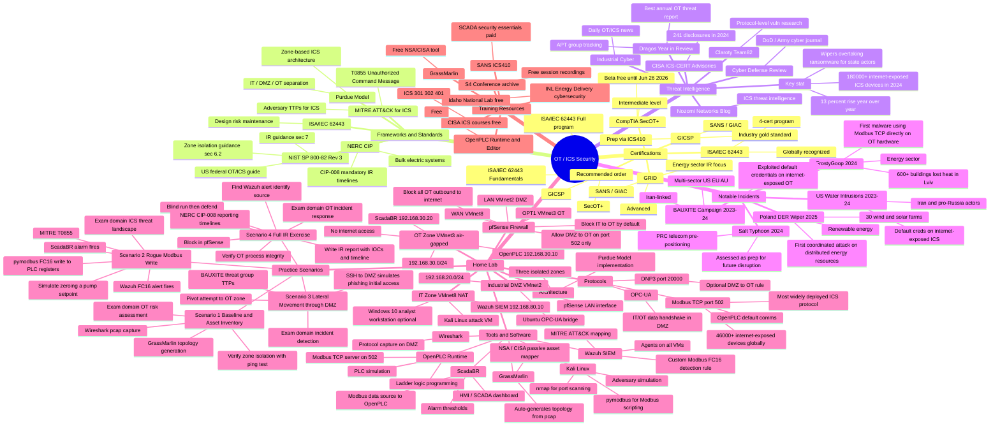

# OT/ICS Security — Mind Map

```mermaid
mindmap
  root((OT / ICS Security))
    Certifications
      CompTIA SecOT+
        Intermediate level
        Beta free until Jun 26 2026
      GICSP
        SANS / GIAC
        Prep via ICS410
        Industry gold standard
      ISA/IEC 62443
        4-cert program
        Globally recognized
      GRID
        SANS / GIAC
        Advanced
        Energy sector IR focus
      Recommended order
        SecOT+
        GICSP
        ISA/IEC 62443 Fundamentals
        ISA/IEC 62443 Full program
    Frameworks and Standards
      NIST SP 800-82 Rev 3
        US federal OT/ICS guide
        Zone isolation guidance sec 6.2
        IR guidance sec 7
      MITRE ATT&CK for ICS
        T0855 Unauthorized Command Message
        Adversary TTPs for ICS
      NERC CIP
        Bulk electric systems
        CIP-008 mandatory IR timelines
      ISA/IEC 62443
        Design risk maintenance
      Purdue Model
        Zone-based ICS architecture
        IT / DMZ / OT separation
    Threat Intelligence
      CISA ICS-CERT Advisories
        241 disclosures in 2024
      Dragos Year in Review
        Best annual OT threat report
        APT group tracking
      Claroty Team82
        Protocol-level vuln research
      Industrial Cyber
        Daily OT/ICS news
      Nozomi Networks Blog
        ICS threat intelligence
      Cyber Defense Review
        DoD / Army cyber journal
      Key stat
        180000+ internet-exposed ICS devices in 2024
        13 percent rise year over year
        Wipers overtaking ransomware for state actors
    Notable Incidents
      FrostyGoop 2024
        Energy sector
        First malware using Modbus TCP directly on OT hardware
        600+ buildings lost heat in Lviv
      BAUXITE Campaign 2023-24
        Iran-linked
        Multi-sector US EU AU
        Exploited default credentials on internet-exposed OT
      Poland DER Wiper 2025
        Renewable energy
        First coordinated attack on distributed energy resources
        30 wind and solar farms
      US Water Intrusions 2023-24
        Default creds on internet-exposed ICS
        Iran and pro-Russia actors
      Salt Typhoon 2024
        PRC telecom pre-positioning
        Assessed as prep for future disruption
    Home Lab
      Architecture
        Purdue Model implementation
        Three isolated zones
      IT Zone VMnet8 NAT
        Kali Linux attack VM
        Wazuh SIEM 192.168.80.10
        Windows 10 analyst workstation optional
      Industrial DMZ VMnet2
        192.168.20.0/24
        Ubuntu OPC-UA bridge
        pfSense LAN interface
      OT Zone VMnet3 air-gapped
        192.168.30.0/24
        No internet access
        OpenPLC 192.168.30.10
        ScadaBR 192.168.30.20
      pfSense Firewall
        WAN VMnet8
        LAN VMnet2 DMZ
        OPT1 VMnet3 OT
        Block all OT outbound to internet
        Allow DMZ to OT on port 502 only
        Block IT to OT by default
      Protocols
        Modbus TCP port 502
          Most widely deployed ICS protocol
          46000+ internet-exposed devices globally
          OpenPLC default comms
        DNP3 port 20000
          Optional DMZ to OT rule
        OPC-UA
          IT/OT data handshake in DMZ
      Tools and Software
        OpenPLC Runtime
          PLC simulation
          Ladder logic programming
          Modbus TCP server on 502
        ScadaBR
          HMI / SCADA dashboard
          Modbus data source to OpenPLC
          Alarm thresholds
        Wazuh SIEM
          Agents on all VMs
          Custom Modbus FC16 detection rule
          MITRE ATT&CK mapping
        Kali Linux
          pymodbus for Modbus scripting
          nmap for port scanning
          Adversary simulation
        GrassMarlin
          NSA / CISA passive asset mapper
          Auto-generates topology from pcap
        Wireshark
          Protocol capture on DMZ
      Practice Scenarios
        Scenario 1 Baseline and Asset Inventory
          Wireshark pcap capture
          GrassMarlin topology generation
          Verify zone isolation with ping test
          Exam domain OT risk assessment
        Scenario 2 Rogue Modbus Write
          pymodbus FC16 write to PLC registers
          Simulate zeroing a pump setpoint
          Wazuh FC16 alert fires
          ScadaBR alarm fires
          MITRE T0855
          Exam domain ICS threat landscape
        Scenario 3 Lateral Movement through DMZ
          SSH to DMZ simulates phishing initial access
          Pivot attempt to OT zone
          BAUXITE threat group TTPs
          Exam domain incident detection
        Scenario 4 Full IR Exercise
          Blind run then defend
          Find Wazuh alert identify source
          Block in pfSense
          Verify OT process integrity
          Write IR report with IOCs and timeline
          NERC CIP-008 reporting timelines
          Exam domain OT incident response
    Training Resources
      CISA ICS courses free
        ICS 301 302 401
      SANS ICS410
        SCADA security essentials paid
      GrassMarlin
        Free NSA/CISA tool
      OpenPLC Runtime and Editor
        Free
      S4 Conference archive
        Free session recordings
      INL Energy Delivery cybersecurity
        Idaho National Lab free
```
